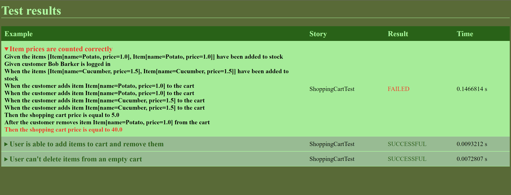

# Documentation

## Contents
[1. Getting started](Documentation.md#1-getting-started)  
[2. Writing tests](Documentation.md#2-writing-tests)  
[3. Running tests](Documentation.md#3-running-tests)  
[4. Reports](Documentation.md#4-reports)  
[5. Configuration](Documentation.md#5-configuration)  


## 1. Getting started
If you are starting a new project, consider using the [examplesB](examplesB)-project as a starting point to skip most of
the steps below.


To use bumbleB, you need to add the following Maven-dependencies to your project:
```
<dependency>
    <groupId>com.jiial.bumbleB</groupId>
    <artifactId>frameworkB</artifactId>
    <version>1.0-SNAPSHOT</version>
</dependency>
<dependency>
    <groupId>org.junit.platform</groupId>
    <artifactId>junit-platform-suite-engine</artifactId>
    <version>1.8.1</version>
</dependency>
```


In addition, you will need the following plugin (the configuration can be changed, but this is the tested configuration):
```
<plugin>
    <groupId>org.apache.maven.plugins</groupId>
    <artifactId>maven-surefire-plugin</artifactId>
    <version>2.19.1</version>
    <dependencies>
        <dependency>
            <groupId>org.junit.platform</groupId>
            <artifactId>junit-platform-surefire-provider</artifactId>
            <version>1.1.0</version>
        </dependency>
        <dependency>
            <groupId>org.junit.jupiter</groupId>
            <artifactId>junit-jupiter-engine</artifactId>
            <version>5.1.0</version>
        </dependency>
    </dependencies>
    <configuration>
        <argLine>
            -javaagent:"${settings.localRepository}"/org/aspectj/aspectjweaver/${aspectj.version}/aspectjweaver-${aspectj.version}.jar
        </argLine>
        <useSystemClassLoader>true</useSystemClassLoader>
        <forkMode>always</forkMode>
        <parallel>all</parallel>
        <useUnlimitedThreads>true</useUnlimitedThreads>
    </configuration>
</plugin>
```
To enable AspectJ, you will also need to create a src/main/resources/META-INF/aop.xml-file with the following content:
```
<aspectj>
    <weaver options="-verbose -showWeaveInfo">
        <include within="com.jiial.bumbleB.aspects.*"/>
        <include within="{PATH_TO_MY_STEPS}.*"/>
        <include within="{PATH_TO_MY_TESTS}.*"/>
    </weaver>
    <aspects>
        <aspect name="com.jiial.bumbleB.aspects.ExampleAspect"/>
        <aspect name="com.jiial.bumbleB.aspects.StepAspect"/>
    </aspects>
</aspectj>
```
The options can be changed by preference. If you have steps and tests in multiple directories, you should add separate
includes for each one. AspectJ is used to access information about parameters passed to method within given/when/then-steps.

If you started with the [examplesB](examplesB)-project as your starting point you can skip all
the steps above.

Finally, you have to set the *settings.localRepository* environment variable to your local Maven repository. This is used in the Maven surefire plugin configuration for AspectJ to find the aspect weaver.


## 2. Writing tests
bumbleB tests are written in Java code, using the methods provided by the [framework](frameworkB/src/main/java/com/jiial/bumbleB/framework/Framework.java).
A basic test will have a Java class with one or more examples annotated with [@Example](annotationsB/src/main/java/com/jiial/bumbleB/annotations/Example.java)
and one or more steps-classes that contain the methods to be used in the test.

A basic example written in bumbleB might look like this:
```
public class CalculatorTests {

    private CalculatorSteps calculatorSteps = new CalculatorSteps();

    @Example
    public void calculatorSumTest() {
        builder
                .name("The calculator can calculate the sum of two numbers correctly")
                .steps(
                        given(calculatorSteps::inputNumbers, 1, 2),
                        when(calculatorSteps::chooseFunction, "sum"),
                        then(calculatorSteps::checkResult, 3)
                )
                .build()
                .run();
    }
}
```
The steps used in the tests might look like this:
```
public class CalculatorSteps {

  private Calculator calculator = new Calculator();
  private int actualResult;

  @Step("a user input the numbers {num1} and {num2}")
  public void inputNumbers(int num1, int num2) {
    calculator.input(num1, num2);
  }

  @Step("the user chooses the {functionName} function")
  public void chooseFunction(String functionName) {
    if (functionName.equals("sum")) {
      actualResult = calculator.sum();
    } else {
      // TODO: Implement other functions
    }
  }

  @Step("the result is: {expectedResult}")
  public void checkResult(int expectedResult) {
    Assert.assertEquals(expectedResult, actualResult);
  }
}
```

bumbleB is also designed to support unit testing. In unit tests, we don't want to bother with separate steps-classes but 
refer to the testable class and its methods directly. To support this, bumbleB offers a way to add a textual description
explicitly via the describeAs-method that is used to replace [@Step](annotationsB/src/main/java/com/jiial/bumbleB/annotations/Step.java)-annotations.

An example of a unit test in bumbleB looks something like this:
```
@Example
public void addToStock() {
    builder
            .name("Adding items to stock")
            .steps(
                    given(stock::addItem, new Item("Foo", 10.0))
                            .describeAs("item {item} is added to the stock"),
                    then(stock::isEmpty).satisfies(Assertions::assertFalse)
                            .describeAs("the stock is not empty"),
                    and(stock::getAmount, "Foo").satisfies(Assertions::assertEquals, 1)
                            .describeAs("there is [amount] {item} in the stock"),
                    and(stock::getItems).satisfies(Assertions::assertEquals, expectedStock)
                            .describeAs("the stock is equal to [stock]")
                )
                .build()
                .run();
}
```
where the referenced methods are normal methods of the class/unit being tested (no annotations or anything else
required). It is also possible to override annotation values with describeAs to mimic "aliases" for annotated steps.

More examples can be seen in the [examplesB](examplesB)-project.

### Important notes
* In step definitions (both annotations and parameters of the describeAs-method) parameters are marked by placing curly brackets {} around each parameter
* Whereas the expected values (set in the satisfies-method) must be marked with square brackets []!
* When doing assertions with the satisfies-method, you should always use the [assertions](frameworkB/src/main/java/com/jiial/bumbleB/assertions/Assertions.java) provided by bumbleB.

## 3. Running tests
When you build your project, bumbleB will generate a human-readable .txt file for each test based on your step definitions.


bumbleB tests are run using the JUnit framework. Each example (scenario) is run as its own test. You can run the tests in your IDE by clicking the run icon that appears 
next to each testable class (a class with one or more examples) to run all the tests within that class, or you can click
a similar icon next to a single example to run a single scenario. To run larger sets of tests, you can define test suites (see more [here](https://junit.org/junit5/docs/current/user-guide/#junit-platform-suite-engine)).
To run all your tests via maven, you can use e.g. the following:
``
mvn clean install test
``

## 4. Reports
bumbleB generates simple HTML test reports when tests are run. The reports are generated in 
target/bumbleB_reports-folder. The reports can be customised via CSS and JavaScript by implementing your own 
/css/bumbleB.css and /js/bumbleB.js files, respectively.

By default, the reports look something like this:


## 5. Configuration
In addition to customising the reports, you can specify a logger for bumbleB to use by creating your own logger class
that implements the [Logger](frameworkB/src/main/java/com/jiial/bumbleB/logging/Logger.java)-interface, and then 
creating a file called /resources/META_INF/bumbleB.logger with a reference to that class.

The framework syntax can also be extended freely by creating your own step-wrapper-methods. An example can be seen in 
the [ExtendedFramework](examplesB/src/main/java/com/jiial/bumbleB/examples/extensions/ExtendedFramework.java) file of the [examplesB](examplesB)-project